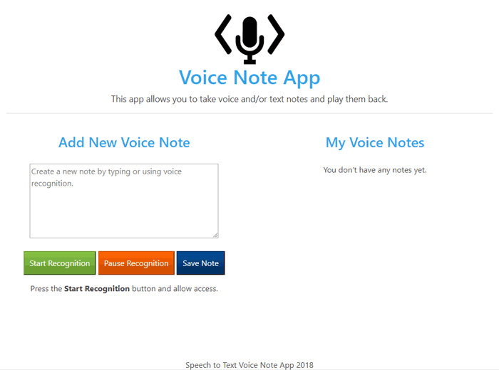

## Voice Note App
### Converting from Speech to Text and Text to Speech using JavaScript


<br>

The purpose of this app is to experiment with the Web Speech API which enables you to incorporate voice data into web apps. The Web Speech API has two parts: SpeechSynthesis (Text-to-Speech), and SpeechRecognition (Asynchronous Speech Recognition.)

This app uses the Web Speech API to build a voice powered note app to do 3 things:

 - Takes notes by using voice-to-text or keyboard input.
 - Save voice notes to localStorage.
 - Display all of the saved notes and give the option to either Listen to the Notes or delete them.

----

### Important Links

__Read Step-by-Step Tutorial: [JavaScript Speech to Text and Text to Speech Note Taking App](https://www.edopedia.com/blog/javascript-speech-to-text-and-text-to-speech-note-taking-app/)__

__Live Demo: [Voice Note App](https://www.edopedia.com/demo/voice-note-app/)__ - (Best Used with Google Chrome)

----

__Project Status - Completed: 05/31/2018__

----

### Website Technologies Used

Description of website technologies used to develop this app.

- HTML
- CSS
- JavaScript
- Bootstrap
- Web Speech API
<br>

----

### File and Directory Structure

```
.
├── assets
│   │
│   ├── css
│   │   │
│   │   └── style.css
│   │
│   ├── ico
│   │   │
│   │   └── favicon.ico
│   │
│   ├── img
│   │   │
│   │   ├── code-mic-150.png
│   │   │
│   │   └── vna-1.gif
│   │
│   └── js
│       │
│       └── script.js
│ 
├── .gitignore
│
├── index.html
│
└── README.md     
       
```

----


### Revision History 

Description of revisions - __Completed: 05/31/2018__

  - [x] Dev - file and directory structure updated - 05/30/2018
  - [x] Dev - starting code - 04/06/2018
  - [x] Dev - styling update - 05/30/2018
  - [x] Dev - completed code - 05/30/2018
  - [x] Dev - readme update - 06/01/2018
